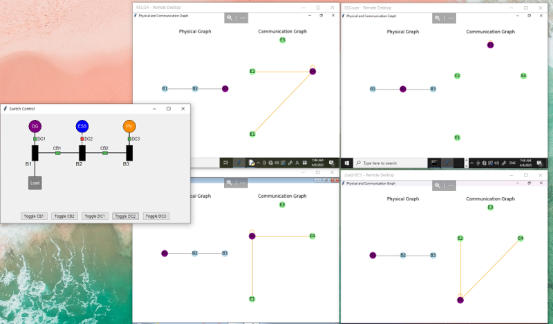
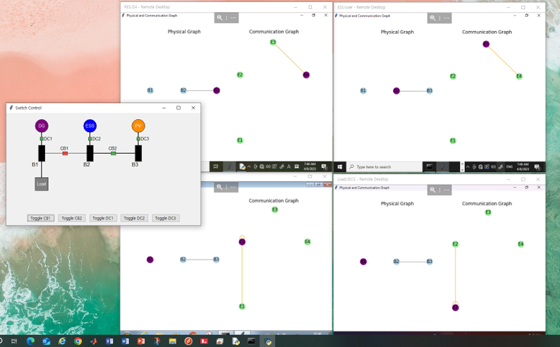
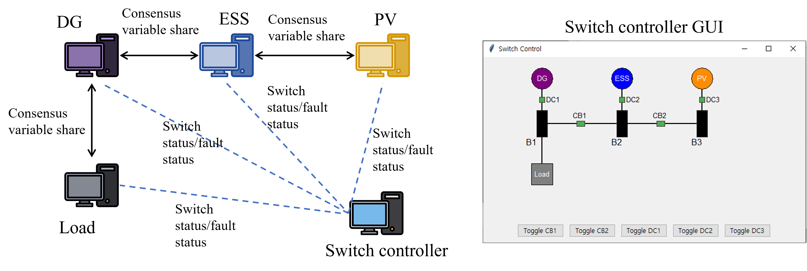

# Distributed Algorithms

This repository contains resources related to distributed algorithms research.

## Folder Structure

- **assets/**: Contains simulation videos and images.
- **dataset/**: Contains data used in the research.
- **SupplementaryMaterials/**: Consists of supplementary results.

## Demonstration Videos

The following videos demonstrate auto-configuration on a 3-bus hardware setup with 5 PCs. One PC acts as a switch controller, while the others act as DG, Load, RES, and ESS.

- **Communication:** The demonstration uses pymodbus TCP for communication. In later versions, communication is replaced with Cyclone DDS, but the videos below use pymodbus TCP.

### Video Demonstrations

- [v1.mp4](assets/v1.mp4)
- [v2.mp4](assets/v2.mp4)

<video src="assets/v1.mp4" controls width="480"></video>
<video src="assets/v2.mp4" controls width="480"></video>

## Cyclone DDS

The following images show the auto-configuration demonstration, where the backend data sharing is handled using Cyclone DDS:

## Test Setup Diagram

The test setup is illustrated below:

## Code Availability

The code for the distributed algorithms will be made available later.

---

**Project supported by KERI.**