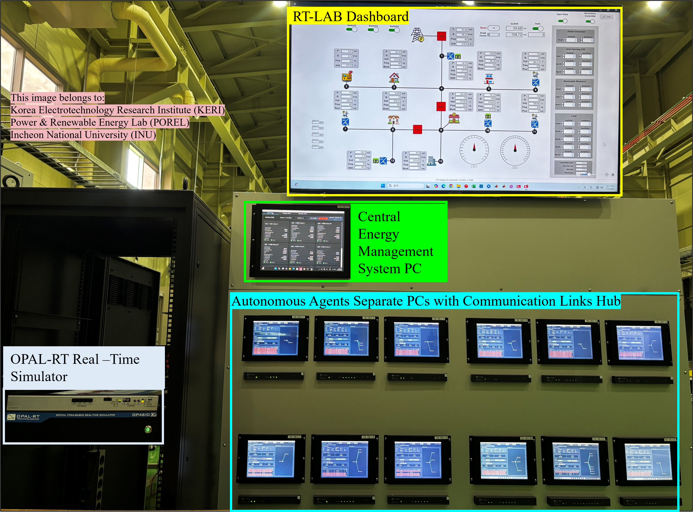

# Distributed Algorithms

This repository contains the resources associated with our research on distributed algorithms. It includes the complete dataset used throughout the study, encompassing both earlier and updated versions to facilitate reproducibility and comparative analysis. At present, we offer limited access to our distributed algorithm through a cloud-based service for public testing and getting results. While, the plotting and visualization scripts are fully available within this repository. The full source code of the proposed algorithm will be released in subsequent versions following comprehensive testing, validation, and documentation to ensure reliability, usability, and long-term maintainability.

## Folder Structure

- **assets/**: Contains simulation videos and images.
- **Data-v1/**: Older dataset version.
- **Data-v2/**: New dataset version, used by the local distributed workflow.
- **services/**: Contains the local service entry points for the distributed algorithm [services/distributed.py](services/distributed.py). and the plotting utility in [services/plottings.py](services/plottings.py).
- **results/**: Stores output files generated by the service, organized by bus name. Each run includes operation results, an iteration_results/ folder with per-timestep convergence history (see below), and, when plotting is requested, a plots/ folder with the generated figures.

#### Demonstration Video

- Hardware Setup : https://youtube.com/shorts/BvvQ4u8MznI?feature=share
- Real-Time Simulation Demonstration : https://youtu.be/GLXogoCrMKQ 

## Hardware In Loop System Test Environment



Other supporting materials from the older version are available in [assets/v1](assets/v1).

## For Test Running the Distributed Algorithm With Our Default Datasets

The distributed workflow is implemented in [services/distributed.py](services/distributed.py). Clone or donwload the repository and in the root directory `DistributedAlgorithms/` follow the following steps:

### Create and activate a virtual environment

### Linux / macOS

```bash
python3 -m venv .venv
source .venv/bin/activate
```

### Windows (Command Prompt)

```cmd
python -m venv .venv
.venv\Scripts\activate.bat
```

### Install dependencies

```bash
pip install -r requirements.txt
```

### Run a test

```bash
python services/distributed.py --bus 13bus_base --use_chronic chronic_1 --horizon 24
```

Arguments:
- --bus: Selects the bus dataset folder under Data-v2.
- --use_chronic: Selects the chronic scenario folder.
- --horizon: Number of timesteps to simulate (default: 24).

Note: The current workflow is limited to at most 150 agents for resource constraints. Dataset folders with more than 150 agents will be rejected before execution.

The service sends each timestep to the cloud-based endpoint where the algorithm is executed, stores the operation results in the corresponding bus folder under results/, and writes the operation_results.csv file for the selected run. For a custom dataset, create a new folder under Data-v2 with the required files such as bus.csv, demand.csv, dg.csv, res.csv, ess.csv, demandmultiplier.csv, renewablemultiplier.csv, and the corresponding chronic folder(s). Then invoke the service with that folder name using the --bus argument.

Note: `results/<bus_name>/` is cleared and recreated at the start of each run (not only on a fully successful one), so that per-timestep files can be written as the horizon loop progresses rather than only at the end.

### Console output per timestep

For each timestep the console prints the API response summary (status, message, results, convergence_iteration) but never the raw `iteration_results` payload, since it can be large. Instead, a separate line reports whether it was actually received for that timestep:

```
[timestep 1] response: { "status": true, "message": "...", "results": {...}, "convergence_iteration": 12 }
[timestep 1] iteration_results received and saved to results/13bus_base/iteration_results/timestep_1.csv
[timestep 2] response: { "status": true, "message": "...", "results": {...}, "convergence_iteration": 4046 }
[timestep 2] iteration_results not received.
```

`iteration_results not received` can happen if the API omits it for a given timestep (for example, when the full per-iteration history would exceed the API's response size limit -- the `message` field printed just above explains why in that case).

### Per-timestep iteration_results CSVs

When `iteration_results` is received for a timestep, it's saved to:

```
results/<bus_name>/iteration_results/timestep_<n>.csv
```

Each row is one solver iteration; columns are `iteration`, then three columns per agent:

| column | meaning |
|---|---|
| `iteration` | 1-indexed solver iteration number |
| `<agent_id>_lambda` | that agent's lambda (consensus price) value at this iteration |
| `<agent_id>_delta` | that agent's delta (mismatch) value at this iteration |
| `<agent_id>_p` | that agent's power setpoint at this iteration |

Only timesteps that actually received `iteration_results` get a CSV -- the folder may have fewer files than the run's `--horizon`.

### Generate plots from the saved results

The plotting utility in [services/plottings.py](services/plottings.py) creates the following figures for a selected bus system:

- operation.png: 24-hour stacked operation plot
- convergence.png: per-interval convergence iteration plot
- topology.png: single-line network topology diagram
- iteration_plots/timestep_\<n\>_lambda_convergence.png: one lambda (λ) convergence plot per timestep, generated from every CSV found in `results/<bus_name>/iteration_results/`

Run the plotting workflow for the existing 13-bus base case with:

```bash
python services/plottings.py --bus 13bus_base
```

All four figure types are generated by default; any of them can be skipped with `--skip-operation-plot`, `--skip-convergence-plot`, `--skip-topology-plot`, or `--skip-iteration-plots` (see the CLI arguments table below).

#### CLI arguments (`services/plottings.py`)

| Argument | Default | Description |
|---|---|---|
| `--bus`, `-b` | *(required)* | Bus/dataset folder name (matches the `--bus` used in `distributed.py`). |
| `--data-root` | `Data-v2` | Root folder containing per-bus dataset folders. |
| `--results-root` | `results` | Root folder containing per-bus result folders. |
| `--operation-csv` | `<results-root>/<bus>/operation_results.csv` | Override path to `operation_results.csv`. |
| `--output-dir` | `<results-root>/<bus>/plots` | Override output folder for the plots. |
| `--topology-params` | `<data-root>/<bus>/plotting_params.json` | Override path to `plotting_params.json`. |
| `--skip-operation-plot` | off | Skip generating `operation.png`. |
| `--skip-convergence-plot` | off | Skip generating `convergence.png`. |
| `--skip-topology-plot` | off | Skip generating `topology.png`. |
| `--skip-iteration-plots` | off | Skip generating the per-timestep `plots/iteration_plots/` figures. |

The script reads the saved operation results from the corresponding `results/<bus_name>/operation_results.csv` file, the per-timestep solver history from `results/<bus_name>/iteration_results/timestep_<n>.csv`, and the topology inputs from the matching `Data-v2/<bus_name>` dataset folder. For all bus systems, topology symbol sizes are loaded from `Data-v2/<bus_name>/plotting_params.json` when present; if that file is missing, the script uses built-in default symbol size values. Each of the four figure types can be omitted independently with `--skip-operation-plot`, `--skip-convergence-plot`, `--skip-topology-plot`, and `--skip-iteration-plots`, in any combination -- for example, `--skip-topology-plot --skip-iteration-plots-plot` regenerates only `operation.png` and `convergence.png`.

#### Lambda (λ) convergence plots

For every `results/<bus_name>/iteration_results/timestep_<n>.csv` file, `plottings.py` produces one figure at `results/<bus_name>/plots/iteration_plots/timestep_<n>_lambda_convergence.png` plotting each agent's `<agent_id>_lambda` column against `iteration`. Agents are colored by category rather than by individual index -- every `DG*` agent shares one color, every `RES*` agent shares another, and so on -- so the legend shows one entry per category (e.g. a single "RES" entry standing in for `RES1`-`RESn`) instead of one entry per agent. The legend is placed above the plot axes in 4 columns, and text (title, axis labels, ticks, legend) is rendered in a serif font at size 12. Only timesteps with a saved `iteration_results` CSV get a figure.

Example result structure for the 13-bus case:

```text
results/
└── 13bus_base/
    ├── operation_results.csv
    ├── iteration_results/
    │   ├── timestep_1.csv
    │   ├── timestep_2.csv
    │   └── ...                  (one file per timestep that received iteration_results)
    └── plots/
        ├── operation.png
        ├── convergence.png
        ├── topology.png
        └── iteration_plots/
            ├── timestep_1_lambda_convergence.png
            ├── timestep_2_lambda_convergence.png
            └── ...               (one figure per timestep_<n>.csv in iteration_results/)
```

## Code Availability

We are planning to release the code including hardware testing version with GUI applications later after comprehensive testing, validation, and documentation.

Author:      Talha Rehman                  (Incheon National University)
Co-authors:  Muhammad Ahsan Khan           (Incheon National University)
              Woon-Gyu Lee                  (Incheon National University)
              Hyeong-Jun Yoo                (KERI)
              Hak-Man Kim (Corresponding)   (Incheon National University)